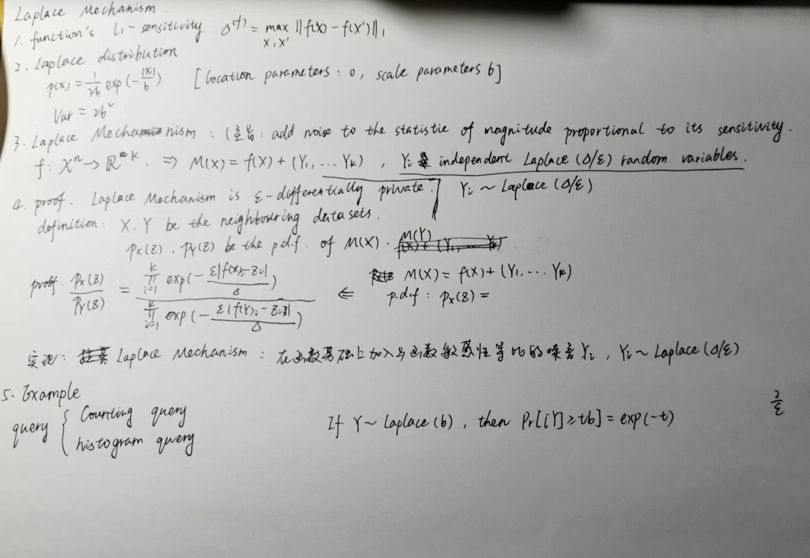

# Differential Privacy

## Intro

+ The first differentially private algorithm, by Warner from 1965

#### Randomized Response：

问题定义：$X_i\in \{0,1\}$，估算$p=\frac{1}{n}\sum_{i=1}^n X_i$

$$Y=\left\{\begin{aligned} &X_i,&\text{with probability }1/2+\gamma \\ &1-X_i,& \text{with probability }1/2-\gamma \end{aligned} \right.$$

+ 所以，$Var[\hat{p}]=Var\left[\frac{1}{n}\sum_{i=1}^n[\frac{1}{2r}(Y_i-1/2+\gamma)]\right]=\frac{1}{4\gamma^2 n^2}\sum_{i=1}^nVar[Y_i]\leq\frac{1}{16\gamma^2n}$.
  
  运用切比雪夫不等式得到：$|\hat{p}-p|\leq O(\frac{1}{\gamma\sqrt{n}})$
  ==$n\rightarrow\infty$时，误差趋近于0==

+ Chebyshev's inequality：？？？

### Differential Privacy（Central Differential Privacy/Trusted Curator)

#### 定义：

问题定义：n个隐私信息$X_1,\dots,X_n$，经过$M$算法得到输出结果$Y$.

差分隐私定义：算法$M$的一个属性，即单独某个数据无法对输出造成很大影响。
即对算法$M:X^n\rightarrow Y$，对只有一个数据不同的任意相邻数据集$X,X^*\in X^n$，满足
$Pr[M(X)\in T]\leq e^\epsilon Pr[M(X^*)\in T]，T\subseteq Y$
则$M$是$\epsilon$-(pure) differentially privat

> $Pr[M(X)\in T]$公式解释：$\frac{Pr[M(X)\in T]}{Pr[M(X^*)\in T]}\leq e^\epsilon$，即两结果属于同一个T的概率相差不超过$e^\epsilon$

1. $\epsilon $常见的范围在[0.1, 5]，越小隐私保护越强
2. any non-trivial differentially private algorithm must be randomized???
3. extension：”group privacy“
4. 'bounded' differential privacy: X one point changed to $X^*$
   'unbounded' differential privacy: X a point added or removed to $X^*$

### Laplace Mechanism

#### Definition:

1. $\mathscr{l}_1$-sensitivity
   sensitivity of a function

   

   拉普拉斯分布是拉普拉斯机制的关键组成部分

2. 拉普拉斯分布

   with location and scale parameters 0 and b,密度函数：

   方差：$2b^2$

3. 拉普拉斯变换

   简单描述：在函数基础上加入与函数敏感性等比的噪音，噪音是Laplace($\delta/\epsilon$) random variables

